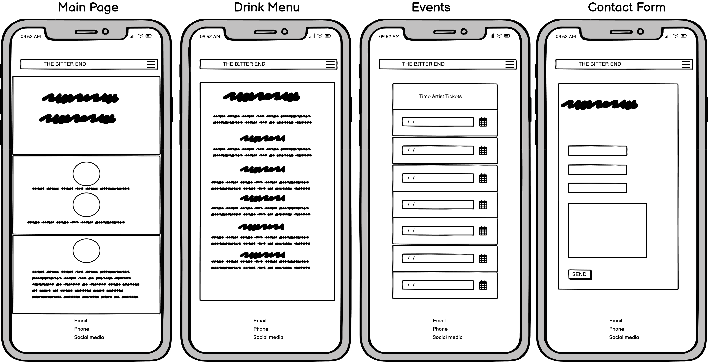
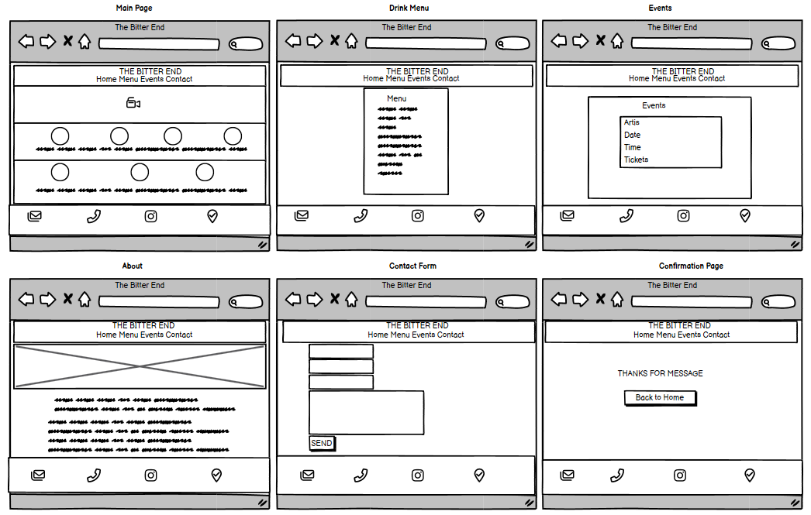

# The Bitter End 
## Overview
“The Bitter End” is a website developed as part of the Code Institute course.

It functions as a stage to display a variety of programming concepts and techniques learned throughout the course.

The primary objective of this site is to delve into and understand the basics of programming.

### About Website
“The Bitter End” is a distinguished cocktail and jazz bar located in Dublin City’s core. 

It provides a memorable blend of artisan cocktails, live jazz tunes, and a welcoming ambiance.

### Deployed website can be found here - [The Bitter End](https://aleksandrdenis.github.io/PP1-The-Bitter-End/index.html)

# Index
1. [UX](#ux)
   1. [User Stories](#user-stories)
   2. [Design](#design)
      1. [Structure](#structure)
      2. [Wireframes](#wireframes)
      3. [Color Scheme](#color-scheme)
      4. [Typography](#typography)
      5. [Images and Video](#images-and-video)
3. [Deployment](#deployment)
4. [Features](#features)
   1. [Finished Product](#finished-product)
   2. [Features Possible To Implement](#features-possible-to-implement)
6. [Testing](#testing)
   1. [Testing User Stories](#testing-user-stories)
   2. [Responsive Web Design](#responsive-web-design)
   3. [Manual Testing](#manual-testing)
   4. [Validator Testing](#validator-testing)
   5. [Bugs](#bugs)
8. [Languages and Programs](#languages-and-programs)
9. [Learning Outcomes](#learning-outcomes)
10. [Credits](#credits)
    1. [Code](#code)
    2. [Content](#content)
    3. [Media](#media)
11. [Acknowledgements](#acknowledgements)

# UX
## User Stories:
* New User
  * As a new user, I want to easily understand the main purpose of the site and learn more about the place.
  * As a new user, I want to view the cocktail menu so that I can decide what to order.
  * As a new user, I want to see the schedule of live jazz performances so that I can plan my visit.
  * As a new user, I want to book tickets for performance.
  * As a new user, I want to know about bar.
  * As a new user, I want to contact bar and book a table so that I can ensure I have a spot on a busy night.
* Returning User
  * As a returning user, I want to check for upcoming jazz performances so that I can attend my favourite shows.
  * As a returning user, I want to see any changes in the cocktail menu so that I can try new drinks.
* Owner goal
  * As an owner, I want to update the cocktail menu so that customers can see our latest offerings.
  * As an owner, I want to promote upcoming jazz performances so that we can attract more customers.

## Design

### Structure

This structure guides visitors through a journey: from getting their first impression on the Main Page, exploring the Drink Menu, learning about Events, reaching out via the Contact Us page, and finally receiving confirmation that their message has been sent. This ensures a smooth and engaging user experience.

### Wireframes
* Mobile
  * Visual blueprint for a website’s structure when viewed on a mobile device.
    
 

 * Desktop
   * Visual blueprint for a website’s structure when viewed on a desktop and larger device.

   
  
### Color Scheme
The chosen color palette for the website design is both sophisticated and calming, which aligns well with the ambiance of a jazz and cocktail bar.

* #2b3218: This is a dark, almost black, green. It’s reminiscent of an old, cozy library or a bottle of aged whiskey. used to style header and footer It gives a rich and elegant feel.
* #ccc894: This is a muted, earthy green. It’s a mid-tone color that’s easy on the eyes and used for backgrounds.
* #dbd5b2: This is a light, warm beige. It’s a neutral color used for backgrounds, to highlight other elements on the page.
* #faebd7: This is a very light, almost white, pink. It’s a soft and inviting color that used for backgrounds to lighten up darker colors.
* #f0f0f8: This is a very light, almost white, blue. It’s a cool and refreshing color that used to give a modern touch to the design.
  
Overall, this color scheme suggests a classy and timeless feel, perfect for a jazz and cocktail bar. The darker and lighter tones can be balanced to create depth and focus on the website. The neutral tones provide a perfect backdrop for any additional colors or images you might want to add.

### Typography

The main font used in the site is Raleway, with Sans Serif as the fallback font.
Raleway is an elegant sans-serif typeface family. Initially designed by Matt McInerney as a single thin weight, it was expanded into a 9 weight family by Pablo Impallari and Rodrigo Fuenzalida in 2012 and iKerned by Igino Marini.

### Images and Video
Images that display the fresh ingredients used in cocktails, along with pictures of performers and background, have been carefully chosen for the website to align with its color scheme and content.

# Deployment 
More information can be found here [GitHub Docs](https://docs.github.com/en/pages/getting-started-with-github-pages/creating-a-github-pages-site)
* The site was deployed to GitHub pages. The steps to deploy are as follows:
   1. In GitHub repository, navigate to the settings tab.
   2. From side menu select pages tab.
   3. Once there select source branch:main, select folder/(root).
   4. Click save, the page provided the link to the completed website.     
* The live link can be found here  [The Bitter End](https://aleksandrdenis.github.io/PP1-The-Bitter-End/index.html)

# Features
**Each page is designed to be user-friendly and visually appealing, reflecting the bar’s unique charm and sophistication. The website’s overall structure is intuitive and easy to navigate, ensuring a positive user experience.**
* Header and Navigation
  * Header contains the website’s logo sets the tone for the website and provides link to home page.
  * Navigation: This is a crucial part of the website that guides users to the different pages. It includes:
    * Home: The main landing page that provides an overview of the website.
    * Cocktails: A page that showcases the variety of cocktails available.
    * Events: This page highlights any upcoming events or special occasions.
    * About: A section that provides information about the establishment or company.
    * Contact: A page with contact form for users to fill out.
      
 
 
* Landing Page
  * The landing page features a hero video that captures the essence of the bar’s atmosphere.
  * After playing video stop and don't loop its a design feature.
  * Overlay text sets the mood and succinctly communicates the website’s purpose.
    
https://github.com/AleksandrDenis/PP1-The-Bitter-End/assets/94542773/32602818-6672-49cb-a603-63f85aa34b37

*  Signature Cocktail Section
   * Features a curated selection of unique and delightful cocktails crafted by our expert mixologists.
    
 

*  Live This Month Section
   * Section is a vibrant showcase of upcoming events and performances.
    
  
  
* Cocktail Menu Page
  * This page provides a detailed list of the cocktails available, complete with descriptions and prices.

* Events Page
  * Here, visitors can find a schedule of upcoming jazz performances and special events. Each event listing includes details such as the date, time, and links to book ticket from [eventbrite](https://www.eventbrite.ie/)

 
* About Page
  * This page offers information about the bar’s history, mission. It also includes photo to give visitors a feel for the bar’s ambiance.
 
 

* Contact Page
  * This page includes a contact form for visitors to send inquiries or feedback directly through the website.

 
 
* Confirmation Page
  * After a visitor submits a form on the Contact page, they are taken to this page. It confirms that their message has been received and provides information about what to expect next and link to return to home page.
 

* Footer
  * Provides contact information for the bar, including its address links to google maps, phone number, email, link to social media and provides information about opening times.
 

## Finished Product

Page | Descktop | Mobile 
--- | --- | --- 
Main |  | 
Cocktails |  | 
Events |  | 
About |  | 
Contact |  | 
Confirmation |  | 

[Back To Top](#the-bitter-end)

## Features Possible To Implement
 * Photo Gallery to:
   * Enhanc the visual appeal.
   * Showcase services.
 * Review Section to:
   * Gather feedback and insights.
   * Build trust and credibility.  

# Testing
## Testing User Stories
   * As a new user, I want to easily understand the main purpose of the site and learn more about the place.
       * Upon entering the site, users are greeted with easily readable navigation bar to go to the page of their choice.
      * The landing page features a hero video that captures the essence of the bar’s atmosphere.
     *  Overlay text sets the mood and succinctly communicates the website’s purpose.     
  * As a new user, I want to view the cocktail menu so that I can decide what to order.
       * Signature Cocktail Section show best drinks available.
     * Cocktail page provides a detailed list of the cocktails available, complete with descriptions and prices.
  * As a new user, I want to see the schedule of live jazz performances so that I can plan my visit.
      * Live this month section is a vibrant showcase of upcoming events.
      * Events page give detail information about events.
  * As a new user, I want to book tickets for performance.
    * Events page has link to book tickets directly from Eventsbrite site.
  * As a new user, I want to know about bar.
    * About page offers information about the bar’s history, mission.
  * As a new user, I want to contact bar and book a table so that I can ensure I have a spot on a busy night.
    * Contact page includes a contact form for visitors to send inquiries or feedback directly through the website.
    * Footer provides more information how user can contact bar.
* As a returning user, I want to check for upcoming jazz performances so that I can attend my favourite shows.
   * Live this month section provide user with new upcoming shows.
   * Event page has up to date information of upcoming events.
* As a returning user, I want to see any changes in the cocktail menu so that I can try new drinks.
  * Signature Cocktail Section show if new drinks have been added to menu.
  * Cocktails page has all drinks with prices included.
 
## Responsive Web Design
* [Responsive Design Checker](https://www.responsivedesignchecker.com/) was used to test the responsiveness of the website on various screen sizes and devices:
  
Screen Size | Device  
--- | --- 
  1920x1200 | Desktop
  1920x1080 | Desktop
  1680x1050 | Desktop
  1600x900  | Desktop
  1440x900 | Desktop
  1366x768 | Notebook
  1024x800 | Notebook
  1024x600 | Notebook
  1366x1024 | Apple iPad Pro
768x1024 | Amazon Kindle Fire
768x1024 | Asus Eee 1000
600x960 | Nexus 7
1024x768 | Nexus 9
800x12 | Samsung Galaxy Tab 10
320x480 | Apple iPhone 3/4/4s
320x568 | Apple iPhone 5/5s
375x667 | Apple iPhone 6/6s/7
414x736 | Apple iPhone 6s Plus / 7 Plus
360x640 | Samsung Galaxy S5/S6/S7
360x640 | Sony Xperia Z2/Z3
411x731 | Google Pixel
384x640 | Nexus 4
411x731 | Nexus 5
411x731 | Nexus 6

* [Chrome DevTools](https://developer.chrome.com/docs/devtools/) was used to test responsiveness in different screen sizes during the development process.

  [Back To Top](#the-bitter-end)

## Manual Testing
**Cross-Browser Compatibility Testing**
   * Edge 

     * Layout and responsiveness: No critical issues were identified.
     * Functionality and performance: No critical issues were identified.
     * Accessibility and usability: No critical issues were identified.
     * Visual appearance and design: No critical issues were identified. 
   * Firefox 

     * Layout and responsiveness: No critical issues were identified.
     * Functionality and performance: No critical issues were identified.
     * Accessibility and usability: No critical issues were identified.
     * Visual appearance and design: No critical issues were identified.
   * Chrome 

     * Layout and responsiveness: No critical issues were identified.
     * Functionality and performance: No critical issues were identified.
     * Accessibility and usability: No critical issues were identified.
     * Visual appearance and design: No critical issues were identified.

     **Common Features Testing**
   * Header
     * The logo is visible and clickable, and it redirects to the home page.
     * The navigation menu has the correct links and labels, and it expands and collapses as expected.
     * The header is responsive and adapts to different screen sizes and orientations.
       
   * Navigation Links
     * The links are visible and clickable, and they redirect to the correct pages.
     * The links have the appropriate text they match the design and style of the website.
     * The links are responsive and adapt to different screen sizes and orientations.
     * The links have the proper active state, they indicate the current page.
       
   * Footer
     * The email is visible and clickable, and it opens the default email client with the correct recipient address.
     * The telephone is visible and clickable, and it initiates a call with the correct number.
     * The social media icon is visible, clickable and open the corresponding social media platform in a new tab.
     * The location icon is visible and interactive and open the google maps in a new tab.
     * The footer is responsive and adapts to different screen sizes and orientations.
       
   * Cocktails Page
     * The drinks are categorized and sorted correctly, and they have the correct names and prices.
       
   * Event Page
     * The events are listed and sorted correctly, and they have the correct names, dates.
     * The events have a link to another website to book tickets, and the link is visible and clickable, and it opens the correct website in a new tab.
     * The links have the hover state that highlighting the button for the customer.

       
   * About Page
     * The information is accurate and relevant, and it reflects the mission and vision of the business.
     * The information is organized and structured, and it uses headings.
       
   * Contact page
     * The contact form is functional and user-friendly, and it has the correct fields, labels, placeholders, and validations.
     * The contact form has a submit button, and it sends the data to the correct recipient and shows a confirmation message.
       
   * Confirmation Page
     * The confirmation page has back to home button, it redirects to the home page.
     * The links have the hover state that highlighting the button for the customer.

## Validator Testing
* HTML
  * When passing the official [W3C](https://validator.w3.org/) validator following errors logged:
    * Element h1 not allowed as child of element <a>. Fixed by inserting a href attribute inside h1 element.
    * Duplicated Id found. Fixed by renaming id.
      
  
      
 * CSS
   * No errors were found when passing through the official [Jigsaw](https://jigsaw.w3.org/css-validator/) validator.
   

    

 * Accessibility
 * I confirmed that website preforms highly, running through Chrome's lighthouse devtools. Colors and fonts being used in throughout the website are easy to read and accessible.
     
     
**Landing Page**
                          
   
     
   **Cocktails Page**
     
  
  
   **Events Page**
     
  
  
  **About Page**
     
  
  
  **Contact Page**
     
  
  
  **Confirmation Page**
     
  

  ## Bugs
  * When testing, I noticed that the logo was stretching across the entire header, which prevented the hamburger menu from being clicked. By adjusting the width of the logo, I fixed the bug. No other known bugs were detected.

# Languages and Programs
* [HTML5](https://en.wikipedia.org/wiki/HTML5)
   * Used for structure.
* [CSS](https://en.wikipedia.org/wiki/CSS)
   * Used for styling.
*  [Vs Code and Codespaces](https://en.wikipedia.org/wiki/Visual_Studio_Code)
  * Used as code editor.
* [MS Word](https://en.wikipedia.org/wiki/Microsoft_Word)
  * Used to write content and detect grammatical errors in a text.
* [MS Clipchamp](https://en.wikipedia.org/wiki/Clipchamp)
  * Used for video editing.
* [Adobe photoshop](https://en.wikipedia.org/wiki/Adobe_Photoshop)
   * Used for image editing.
* [Balsamiq Wireframes](https://en.wikipedia.org/wiki/Balsamiq)
   * Used to create wire frame.
# Learning Outcomes
1. Understanding HTML and CSS:
      * Learn the basic structure of an HTML document.
     * Familiarize yourself with CSS selectors for styling HTML elements.
     * Create a CSS stylesheet to apply consistent styles across web pages.
     * Responsive web and understanding of Media Queries.
2. Git and GitHub:
     * Understand the importance of version control systems (VCS) like Git.
     * Explore GitHub, which provides hosting for your repositories and useful tools for managing code.
     * Create different versions of code using Git branches.
3. Git Commits:
   * Commit changes frequently to track progress.
   * Use of descriptive commit messages to explain each change.    

# Credits
## Code
* [Mmdn](https://developer.mozilla.org/en-US/) and [W3Schools](https://www.w3schools.com/) were consulted on a regular basis to  understand the code being implement.
* To create hamburger menu and position form code was used from Ci project "Love running".

## Content
* All content was written by the developer.

## Media
* All Images and videos from [Pexels](https://www.pexels.com/)

# Acknowledgements
* Code Institute and its amazing Slack community for their support and providing me with the necessary knowledge to complete this project.
* My tutor, Marcel, for his invaluable feedback and guidance.

[Back To Top](#the-bitter-end)

